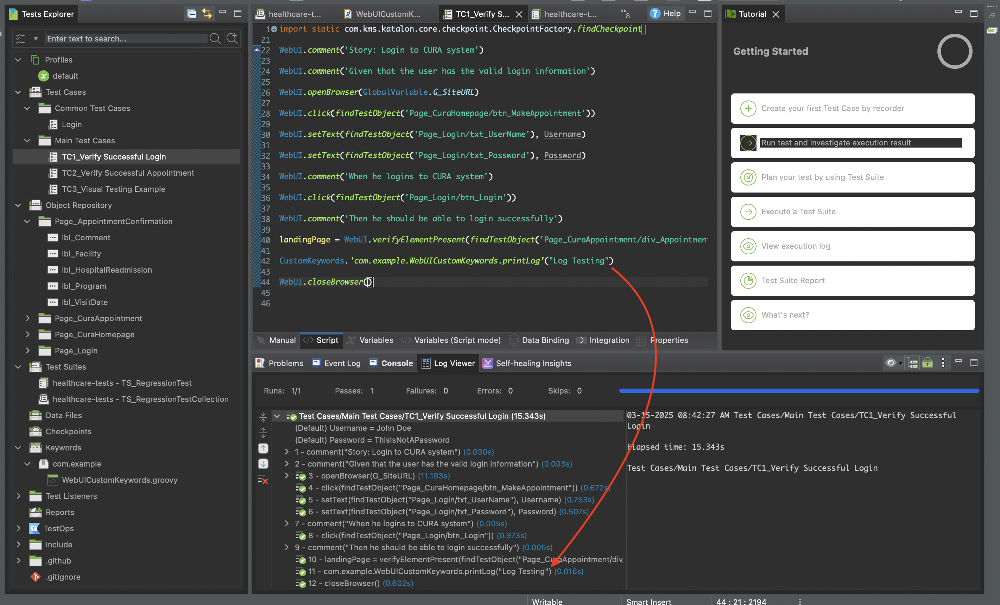

This discussion is part of my notes on the Katalon Automation Framework series. Now, I will focus on web testing.

<!--more-->

<p align="center">﷽</p>

This section is dedicated to exploring the world of web testing automation using Katalon. If you haven't installed Katalon yet, you can do it by following my notes on [Automation With Katalon (Mobile Testing).](/posts/2025/02/automation-with-katalon-mobile-testing/) let's get started to start web testing!

# Web Testing

## Background

When starting web testing in Katalon Studio, the best way to learn is by exploring the provided sample projects. Katalon offers comprehensive and well-structured sample projects, ranging from simple test cases to more advanced scenarios. There are two main sample projects for web testing.

Before diving into the details, note that Katalon supports scripting using the _Groovy language_. If you have learned Java, you will find Groovy easy to understand.

### 1. Healthcare Sample Project

The Healthcare Sample Project is designed to introduce the fundamentals of WebUI testing in Katalon Studio. This project simulates an end-to-end testing workflow for the CURA Healthcare Service web application. The key focus areas of this project include:

- User authentication: Testing the login functionality with valid and invalid credentials.
- Appointment scheduling: Automating the process of selecting a facility, providing medical details, and confirming an appointment.
- Navigation and validation: Ensuring that pages load correctly and expected elements are present.
- Basic scripting techniques: Demonstrating how to create test cases using recording, manual scripting, and script mode.
- Object repository usage: Managing web elements efficiently.

The url for this sample project is [https://katalon-demo-cura.herokuapp.com/](https://katalon-demo-cura.herokuapp.com/)

This project is ideal for beginners who want to get familiar with Katalon Studio’s core features and WebUI automation testing.

### 2. Shopping Cart Sample Project

The Shopping Cart Sample Project takes a step further by incorporating data-driven testing (DDT). This project automates the testing of an e-commerce website called Katalon Shop. The key aspects of this project include:

- Adding items to the cart: Verifying that different products can be selected and displayed correctly in the shopping cart.

- Checkout process validation: Ensuring that prices, totals, and payment steps function correctly.

- Data-driven testing: Running multiple test cases with different sets of data stored in external sources like Excel files, databases, or CSV files.

- Variable binding: Connecting input data with test scripts dynamically to test various scenarios without modifying the script manually.

This project is ideal for testers who want to understand how to implement data-driven testing and automate multiple test scenarios efficiently.

The url for this sample project is [http://cms.demo.katalon.com](http://cms.demo.katalon.com)

Here is the table both those sample projects:

| Feature                    | Healthcare Sample Project                         | Shopping Cart Sample Project                                           |
| -------------------------- | ------------------------------------------------- | ---------------------------------------------------------------------- |
| **Focus**                  | Basic WebUI testing                               | Data-driven testing                                                    |
| **Application Under Test** | CURA Healthcare Service                           | Katalon Shop                                                           |
| **Key Features**           | Login, appointment booking, navigation validation | Shopping cart functionality, checkout process, variable-driven testing |
| **Test Techniques Used**   | Recording, manual scripting, script mode          | Data binding, external data sources, automated test iteration          |
| **Best For**               | Beginners learning WebUI automation               | Testers exploring data-driven testing                                  |

## 1. Healthcare Sample Project

To start the Healthcare Sample Project, follow these steps:

1. Click on File > Open Project > New Sample Projects > Sample Web UI Tests Project (Healthcare). 

2. File the Project Name and click OK. 
3. We can see the project already loaded. 

   Let's first take a look at the _Profiles_ section. In Katalon Studio, a Profile is an execution configuration that stores global variables used across test cases. These profiles help manage different testing environments and configurations efficiently. You will see the _G_Timeout_, _G_SiteURL_ and _G_ShortTimeout_ variables in this section. The _G_ mean stands for Global.

4. Another section is _Custom Keywords_. _Custom Keywords_ are a feature that allows user to create reusable functions or keywords that can be used across multiple test cases. This feauture enhances modularity and efficiency in test automation To see the custom keywords, in the Test Explorer panel, go to **Keywords > com.example > WebUICustomKeywords.groovy**.

   

Some functions of Custom Keywords are:

- Reduce redundancy - Avoid writing the same code repeatedly in different test cases.
- Improve Readablility & Maintainability - Make test scripts cleaner and easier to understand.
- Handle Complex Processes - Manage complex testing scenarios such as database validation, API calls or special interactions with web elements.

To Create a Custom Keywords are:

- On the Test Explorer panel, go to **Keywords > com.example > WebUICustomKeywords.groovy**.
- We will create Custom Keywords in the existing file. Add the following code:

```groovy
  @Keyword
	  def printLog(String logMessage) {
	  	println("Log Message: " + logMessage)
	  }
```

- To use Custom Keywords above, we can try in the **Main Test Cases > TC1_Verify Successful Login**. Add the following code:

```groovy
    CustomKeywords.'com.example.WebUICustomKeywords.printLog'("Log Testing")
```


- Finally, when we try to run test case, the Custom Keywords will be executed. 

## 2. Shopping Cart Sample Project

Similarly, to open the Healthcare Sample Project, follow these steps to start the Shopping Cart Sample Project:

1. Click on File > Open Project > New Sample Projects > Sample Web UI Tests Project (Shopping Cart). 
2. Fill the Project Name and click OK. 
3. We can see the project already loaded. 

   It's different from the Healthcare Sample Project. the _Profiles_ section has more global variables than the Healthcare Sample Project. Since the sample project is a little bit more complex.

4. Another difference is in _Data Files_ section and in the _Custom Keywords_ section.
   _Data Files_ section is used to store data that can be used in test cases. This data can be in various formats such as CSV, Excel, or JSON.
   _Custom Keywords_ in the Shopping Cart Sample Project has more functions than the Healthcare Sample Project. We can see there are **Login**, **Utils**, etc
   
