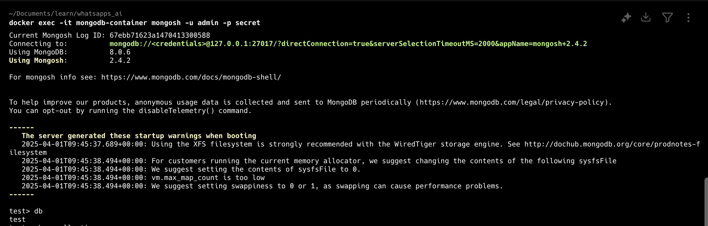
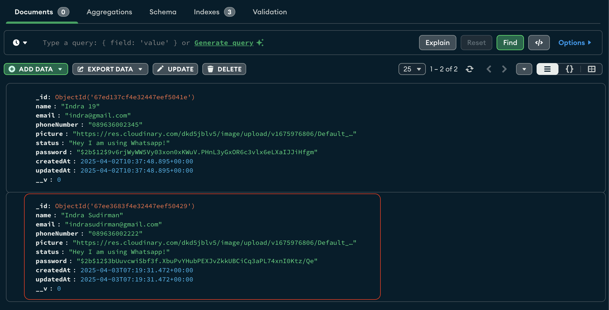
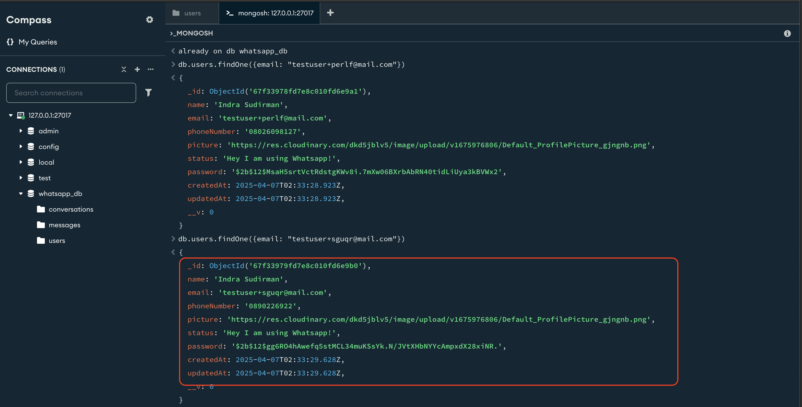

JMeter is powerful tool for load testing. This guide provides a simple sample to set up and run a load test for for REST API using JMeter.

<!--more-->

<p align="center">﷽</p>

## Background

Start from my corious how the JMeter's feature works. I start to create simple project to deep dive JMeter. Here are the breakdown what I have prepared :

1. JMeter already installed in my local (Mac M1)
2. Docker for mongoDB, since my project use mongoDB as the database.
3. Simple Rest API project, I used my old project but for this JMeter exploration I only use `register` endpoint.
4. Postman to test the Rest API Webservices already work properly.
5. MongoDB Compass [optional] We can use command line terminal if you won't installed MongoDB Compass.

Let's get started.

### JMeter

To install JMeter is quiet straight forward, you can install it on it's website [JMeter](https://jmeter.apache.org/usermanual/get-started.html#install) since I'm using Mac M1, I use Homebrew to install JMeter.

```bash
brew install jmeter
```


### MongoDB installed with Docker

To achieve this, I just run this command :

```bash
docker run -d --name mongodb-container -p 27017:27017 -e MONGO_INITDB_ROOT_USERNAME=admin -e MONGO_INITDB_ROOT_PASSWORD=secret mongo
```


Then you need to run this command to access MongoDB in terminal :

```bash
docker exec -it mongodb-container mongosh -u admin -p secret
```



For now, the prerequisite in Docker is done.

### Simple Rest API project

I used my old project Node.js with Express.js. You can clone it from my GitHub [here](https://github.com/indrabsudirman/whatsapp-bismillah) you can use your own or other project. Please follow the [`README`](https://github.com/indrabsudirman/whatsapp-bismillah) if you want to use my project for this tutorial.

<!-- Disini belum update readme project ya -->

If the project already successful run, and no encountered any errors like this log :


### Use Postman to test the Rest API

Let's add new request in postman as follow:


based on image above, we can see the request success, the response status is 200 and there are some response data like `token` and detail user it self.

### Validate the data successfully inserted into MongoDB

At this point I will validate using MongoDB Compass and via Terminal. Let's get started.

#### MongoDB Compass

Please see the image below, we can see the data successfully inserted into database.


#### MongoDB Terminal

Similiar in the MongoDB Compass, in the terminal MongoDB, we can see the data successfully inserted into database.


## Load Testing REST Web Services

Now, let's start to the main topic, Load Testing REST Web Services. To do this, I try with two option:

1. Load Testing with CSV file data.
2. Load Testing with `RandomString` function provided by JMeter to generate random email and phone number.

### Load Testing with CSV file data

Before start to the load testing, we need to prepare the data in CSV file, to achieve this, I create Python script to generate the data.

The script as follow, we just need to run the script below :

```bash
import csv

# Global variables
totalUser = 5
name_prefix =  "Indra 5 User"
email_prefix = "indra_5_user"
phone_number_base = "08961234567"
password = "Test@12345"

# Nama file CSV
filename = "user_data.csv"

# Write data to file CSV
with open(filename, mode='w', newline='') as file:
    writer = csv.writer(file)

    # Header kolom
    writer.writerow(["name", "email", "phoneNumber", "password", "confirmPassword"])

    # User data
    for i in range(1, totalUser + 1):
        name = f"{name_prefix} {i}"
        email = f"{email_prefix}{i}@mail.com"
        phone_number = f"'{phone_number_base}{i}"
        writer.writerow([name, email, phone_number, password, password])

print(f"CSV file '{filename}' berhasil dibuat dengan {totalUser} user.")
```

If we run the script above, the output is like this :


### Load Testing with `RandomString` function JMeter

To start Load Testing with `RandomString` the step are:

1. Click File -> New.
   Empty Test Plan Window will opened. Rename the Test Plan to **Register Test Plan** as the image below:
   

2. Create **New Thread Group** by right click on the **Register Test Plan** -> **Add** -> **Threads (Users)** -> **Thread Group**
   

   at the Thread Group window, we set the **Number of Threads (users)** to **5**, **Ramp-Up Period (seconds)** to **1** and **Loop Count** to **1**. This means JMeter will distribute the start of 5 users evenly over the 1 second period (one user starting every 0.2 seconds = 1 second / 5 users). The Loop Count of 1 means each user will execute the test scenario once.

   We can see the setting as follow :
   

3. Create **New HTTP Request** by right click on the **Thread Group** -> **Add** -> **Sampler** -> **HTTP Request**

   at the HTTP Request window, we set the **Name** to **Register**, **Protocol** to **HTTP**, **Server Name or IP** to **localhost**, **Port** to **8000**, **Path** to **/api/v1/auth/register**, **HTTP Request** to **POST**.
   

4. In the **HTTP Request** window, we fill the **Body Data** as follow :

   ```json
   {
     "name": "Indra Sudirman",
     "email": "testuser+${__RandomString(5,abcdefghijklmnopqrstuvwxyz,)}@mail.com",
     "phoneNumber": "08${__RandomString(${__Random(8, 10)}, 0123456789,)}",
     "password": "Testing123",
     "confirmPassword": "Testing123"
   }
   ```

   

   Since the `email` and `phoneNumber` are must be unique in the API spec, we use the `RandomString` function by JMeter to generate it.

   - email: `testuser+${__RandomString(5,abcdefghijklmnopqrstuvwxyz,)}@mail.com`
     the email will concate with the prefix with `testuser+` then 5 character from `abcdefghijklmnopqrstuvwxyz` and suffix with `@mail.com`.
   - phone number: `08${__RandomString(${__Random(8, 10)}, 0123456789,)}`
     the phone number will concate with the prefix with `08` then random number from 8 to 10 character from `0123456789`.

5. Create **HTTP Header Manager** by right click on the **Register HTTP Request** -> **Add** -> **Config Element** -> **HTTP Header Manager**
   at the HTTP Header Manager window, we set the **Name** to **Content-Type**, **Value** to **application/json**.
   

6. Create some report like:

- **View Results Tree** by right click on the **Register Test Plan** -> **Add** -> **Listener** -> **View Results Tree** let it blank by default.
- **Summary Report** by right click on the **Register Test Plan** -> **Add** -> **Listener** -> **Summary Report** let it blank by default.
- **Aggregate Report** by right click on the **Register Test Plan** -> **Add** -> **Listener** -> **Aggregate Report** let it blank by default.
- **View Results in Table** by right click on the **Register Test Plan** -> **Add** -> **Listener** -> **View Results in Table** let it blank by default.
  

Now, we can run the test by click the green play button.


We can see the result as follow:


If we check the MongoDB Compass, we can see the data successfully inserted into database.


Hurray! the data successfully inserted into database. Wait, let's double check the data in MongoDB Compass.

Let's see the last data.


once again if we check the MongoDB Compass.


Finally, we can assume the load test already done.
