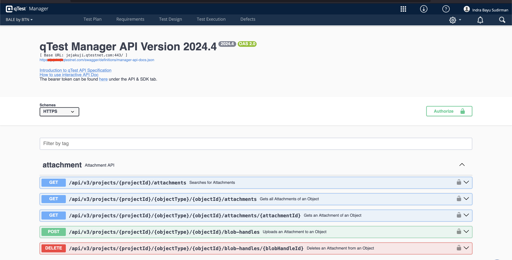
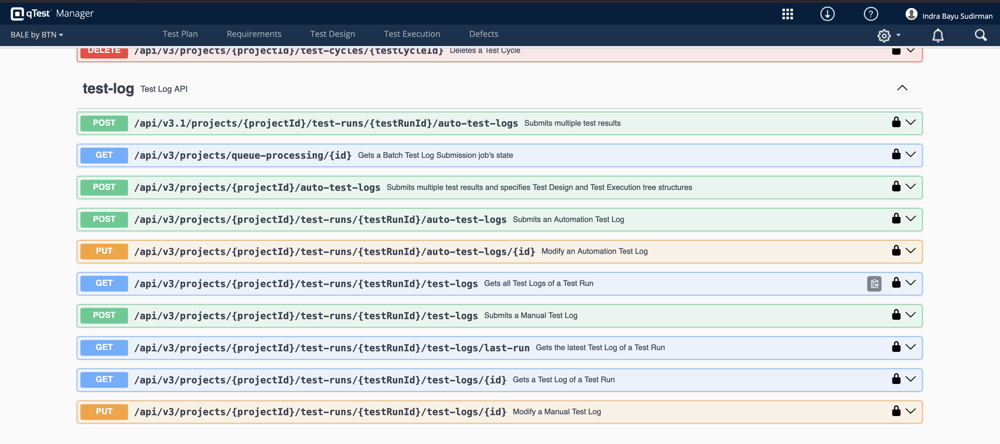
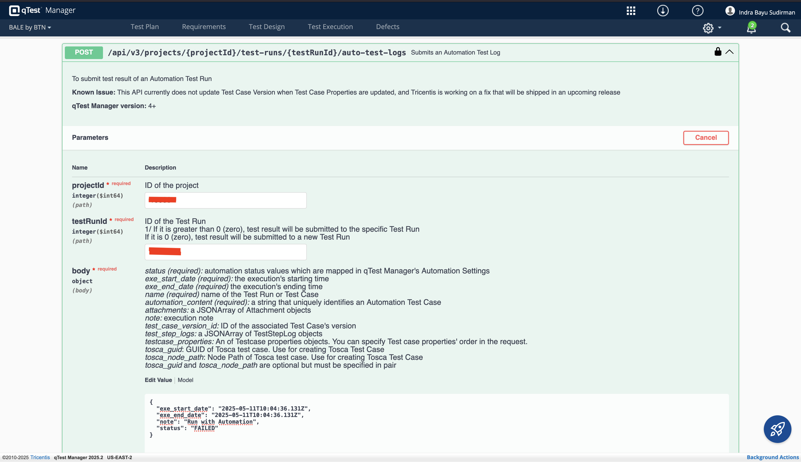
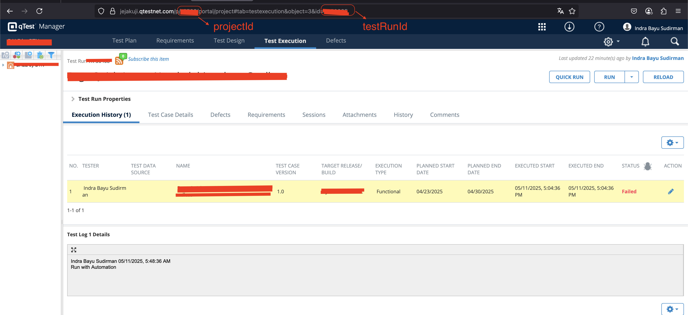
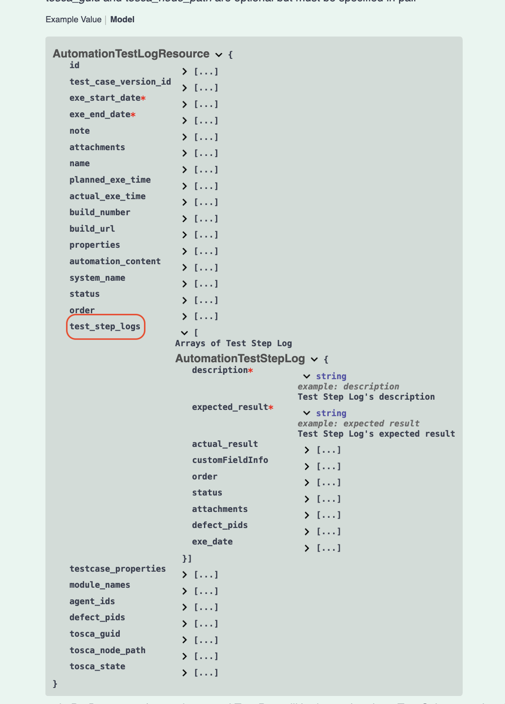
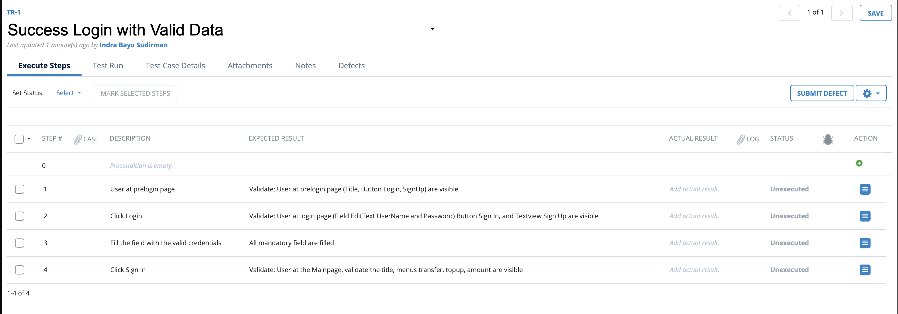
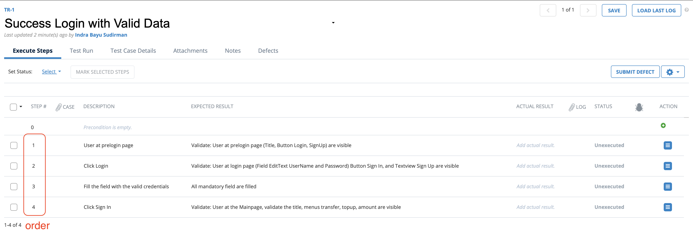
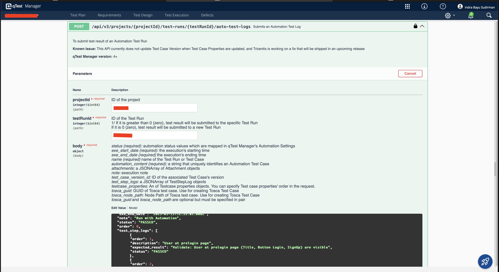
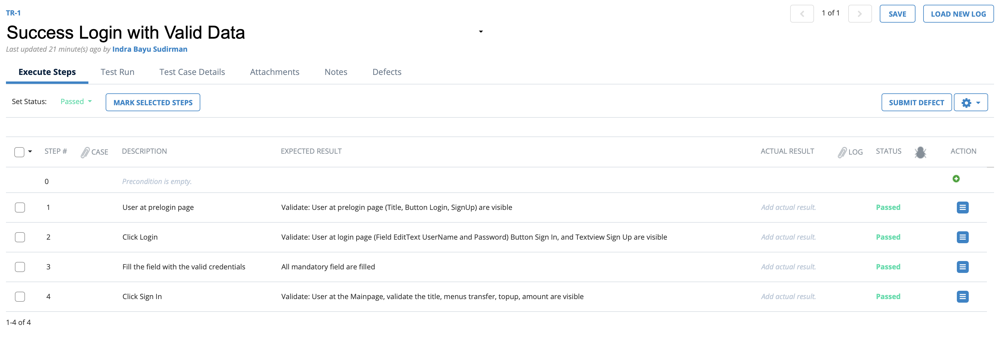
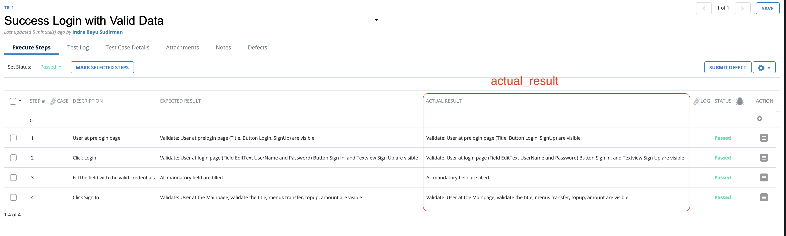

The goal of Katalon and qTest integration is to enable seamless communication between the two tools. Like automate sync the test result from Katalon to qTest.

<!--more-->

<p align="center">﷽</p>

## Background

If you read my previous post [How to Integrate Katalon with qTest](/posts/2025/04/intergration-qtest-in-katalon/)

That post succeeded in integrating katalon with qTest but I got an issue, which is the katalon result not updated at the qTest run. I have searched some threads in the katalon forum but didn't find any solution.

Some threads that I found but didn't solve that issue :

- [Katalon Threads](https://forum.katalon.com/t/report-is-not-getting-uploaded-in-qtest-after-integration-with-katalon-latest-version/39522)
- [View and upload Katalon Studio test execution results to qTest](https://docs.katalon.com/katalon-studio/integrations/test-analysis/qtest/view-and-upload-katalon-studio-test-execution-results-to-qtest)

**As an engineer with a problem-solving mindset, I always try to find alternative solutions when things don't go as planned.**

I found qTest swagger API documentation and tried to use it to update the test result.


I explored the API and found that I can update the test result using the test-log section on that swagger documentation.


Now, I'm trying to post the test result using this endpoint.

`/api/v3/projects/{projectId}/test-runs/{testRunId}/auto-test-logs`


Based on the image above, I filled the request body with the following data:
`projectId`, `testRunId` and the `body`. The other fields are optional, let's default value.

| Field     | Description                                                                                                                                                 |
| --------- | ----------------------------------------------------------------------------------------------------------------------------------------------------------- |
| projectId | The ID of the project that the test run belongs to. You can find this ID in the URL of the project page.                                                    |
| testRunId | The ID of the test run that the test log belongs to. You can find this ID in the URL of the test run page. Ussually, it's the number at the end of the URL. |
| body      | The body of the test log.                                                                                                                                   |

The result is:


You can see the result of `STATUS`, `EXECUTED START`, `EXECUTED END` and `NOTES` at the Test Log 1 Details.
The values are from the request body.

```json
{
  "exe_start_date": "2025-05-11T10:04:36.131Z",
  "exe_end_date": "2025-05-11T10:04:36.131Z",
  "note": "Run with Automation",
  "status": "FAILED"
}
```

Notes: The `exe_start_date` and `exe_end_date` are converted to my local timezone (UTC+07:00).

## Let's Explore More That Endpoint

We can see in the `body` request that we can update the `status` for the each test step.


Since my goal is to update the status of the test run and it's step's status, So I'm going to use `test_step_logs` property. The `test_step_logs` is an array of Test Step Log. It's has 2 required properties: `description` and `expected_result` which are marked with a red asterisk `*`.

### Prepare test run that has some test steps

I create a test run that has 4 test steps.

My goal is to update the status of the test run and it's step's status.

### Update the status of the test run and it's step's status via Swagger API

To update the status of the test run and it's step's status, I'm going to use the `test_step_logs` property. The `test_step_logs` is an array of Test Step Log. It's has 2 required properties: `description` and `expected_result` which are marked with a red asterisk `*`. That already explained in the previous section.
The body request is:

```json
{
  "exe_start_date": "2025-05-11T12:48:01.008Z",
  "exe_end_date": "2025-05-11T12:55:01.008Z",
  "note": "Run with Automation",
  "status": "PASSED",
  "order": 0,
  "test_step_logs": [
    {
      "order": 1,
      "description": "User at prelogin page",
      "expected_result": "Validate: User at prelogin page (Title, Button Login, SignUp) are visible",
      "status": "PASSED"
    },
    {
      "order": 2,
      "description": "Click Login",
      "expected_result": "Validate: User at login page (Field EditText UserName and Password) Button Sign In, and Textview Sign Up are visible",
      "status": "PASSED"
    },
    {
      "order": 3,
      "description": "Fill the field with the valid credentials",
      "expected_result": "All mandatory field are filled",
      "status": "PASSED"
    },
    {
      "order": 4,
      "description": "Click Sign In",
      "expected_result": "Validate: User at the Mainpage, validate the title, menus transfer, topup, amount are visible ",
      "status": "PASSED"
    }
  ]
}
```

and the testpad will be like this:


Before I execute the swagger API, the request will be like this:

please note the other fields are default value. I just added the `test_step_logs` property.

After I execute the swagger API, the request will be like this:


the test step status are updated to `PASSED`.

How about if I add the `actual_result` property in the `test_step_logs`? The result will be like this:



The body request is:

```json
{
  "exe_start_date": "2025-05-11T14:48:01.008Z",
  "exe_end_date": "2025-05-11T14:55:01.008Z",
  "note": "Run with Automation",
  "status": "PASSED",
  "order": 0,
  "test_step_logs": [
    {
      "order": 1,
      "description": "User at prelogin page",
      "expected_result": "Validate: User at prelogin page (Title, Button Login, SignUp) are visible",
      "actual_result": "Validate: User at prelogin page (Title, Button Login, SignUp) are visible",
      "status": "PASSED"
    },
    {
      "order": 2,
      "description": "Click Login",
      "expected_result": "Validate: User at login page (Field EditText UserName and Password) Button Sign In, and Textview Sign Up are visible",
      "actual_result": "Validate: User at login page (Field EditText UserName and Password) Button Sign In, and Textview Sign Up are visible",
      "status": "PASSED"
    },
    {
      "order": 3,
      "description": "Fill the field with the valid credentials",
      "expected_result": "All mandatory field are filled",
      "actual_result": "All mandatory field are filled",
      "status": "PASSED"
    },
    {
      "order": 4,
      "description": "Click Sign In",
      "expected_result": "Validate: User at the Mainpage, validate the title, menus transfer, topup, amount are visible ",
      "actual_result": "Validate: User at the Mainpage, validate the title, menus transfer, topup, amount are visible ",
      "status": "PASSED"
    }
  ]
}
```

## Let's Try to Update the Test Result via Katalon

Now, I'm going to try to update the test execution result via Katalon. The goal is to update the test result via Katalon. Everytime I execute the test, the test result will be updated to the qTest.

1. Katalon Studio Project
   I create a new project with the name `qTest Katalon Integration`. You can clone the project. From the github repo [qTest Katalon Integration](https://github.com/indrabsudirman/Katalon-QTest-Integration)

Once you clone the project, you can see on README.md file how to run the project, prepare the properties file, json file. If you already follow the README.md file, you can successfully run the project.

Curious? To see the project, here is the preview:

[](https://drive.google.com/file/d/12HwcNFkrh2G9N6NlSeUy8Gxvkw1cUXo-/view?usp=sharing)

That's all my notes.
