Automation testing is one of the core responsibilities of a QA Engineer, one of which is performing API (Application Programming Interface) automation testing. The goal is to avoid repetitive manual testing, making the process more efficient and effective in the long run — especially for Regression Testing.

In this post, I will walk through API automation testing using Postman. Postman is a widely popular tool for API testing, and it comes with built-in support for automation testing — such as adding JavaScript scripts to each pre-request and post-request.

<!--more-->

<p align="center">﷽</p>

## Background

In the world of QA testing, API automation testing is a crucial component. As applications evolve, testing requirements grow exponentially. Therefore, API automation testing becomes the ideal solution. Imagine if the process were always done manually; for example, if your financial mobile app has 50 endpoints that need to be hit just to proceed to the main test suite. This would undoubtedly be extremely time-consuming. If done repeatedly, any QA engineer (being human, after all) would surely find it exhausting.

Fortunately, API automation testing is here to help. In this post, I will discuss one way to achieve this: using Postman. We just need to gather the API endpoints. For mobile apps, these can usually be found in the system/network logs or by asking the Backend Developers. Once collected, we can start creating requests and running tests.

In this guide, I have set up 3 sample endpoints that already created at my own domain [https://api.belajarkode.id/sample-api-automation](https://api.belajarkode.id/sample-api-automation). Let's check the endpoints below:

1. Register
2. Verify OTP
3. Login Member Using Email or Phone Number

I will use these endpoints to demonstrate API automation testing using Postman. The sample API requests are shown below:
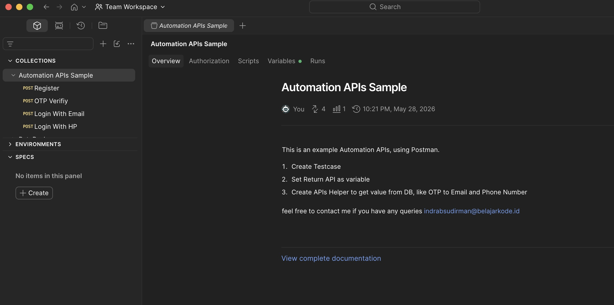


---

## 1. Register

Register endpoint is used to register a new member. This endpoint is using POST method. The payload properties are:

- `full_name`: Full name of the member. (String) - (Required)
- `email`: Email of the member. (String) - (Required)
- `phone_number`: Phone number of the member. (String) - (Required)
- `pin`: 6 digits Personal Identification Number. (String) - (Required)

```http
POST {{host}}/auth/register
Content-Type: application/json

{
    "full_name": "[FULL_NAME]",
    "email": "[EMAIL_ADDRESS]",
    "phone_number": "[PHONE_NUMBER]",
    "pin": "[PIN]"
}
```

Since to register need to provide different full name, email, phone number and pin for each register, so I will use **pre request** script to generate random full name, email, phone number and pin. To achieve this, I will use the following script:

```
// 1. Collection of names (you can add more if you want)
const kataDepan = ["Arkan", "Bintang", "Cakra", "Danish", "Erlangga", "Fathan", "Gavin", "Arif", "Irfan", "Jaka", "Kenzie", "Liem", "Mahendra", "Naufal", "Rayan", "Satria", "Taufik", "Vino", "Yuda", "Zayn", "Aisha", "Bella", "Citra", "Dania", "Elena", "Fiona", "Gisella", "Hana", "Indah", "Jasmine", "Keisha", "Laras", "Nabila", "Olivia", "Putri", "Raisa", "Syafira", "Tiara", "Vanya", "Zahra", "Nurlubna"];
const kataBelakang = ["Aditya", "Budiman", "Cahyono", "Dirgantara", "Fadillah", "Gunawan", "Hidayat", "Irawan", "Kusuma", "Laksana", "Mulyono", "Nugroho", "Pamungkas", "Ramadhan", "Saputra", "Utomo", "Wibowo", "Yulianto", "Anindya", "Dewantara", "Fitriani", "Gemilang", "Kurniawan", "Lestari", "Mahardika", "Oktaviani", "Permana", "Raharjo", "Sucipto"];

// Helper functions for generating random values
const getRandom = (array) => array[Math.floor(Math.random() * array.length)];
const getRandomInt = (min, max) => Math.floor(Math.random() * (max - min + 1)) + min;

// 2. Generate Data
// Name
const depan = getRandom(kataDepan);
const belakang = getRandom(kataBelakang);
const fullName = `${depan} ${belakang}`;

// Email (using first name + last name + random number to be unique)
const email = `${depan.toLowerCase()}${belakang.toLowerCase()}${getRandomInt(10, 99)}@gmail.com`;

// Phone number (Indonesian format with prefix 08 + 10 random digits)
let phoneNumber = "08";
for (let i = 0; i < 10; i++) {
    phoneNumber += getRandomInt(0, 9);
}

// PIN (6 random digits)
let pin = "";
for (let i = 0; i < 6; i++) {
    pin += getRandomInt(0, 9);
}

// 3. Set to Postman Environment / Collection Variables
pm.collectionVariables.set("fullName", fullName);
pm.collectionVariables.set("email", email);
pm.collectionVariables.set("phoneNumber", phoneNumber);
pm.collectionVariables.set("pin", pin);

console.log({ fullName, email, phoneNumber, pin });
```

See the image below for the implementation in Postman:
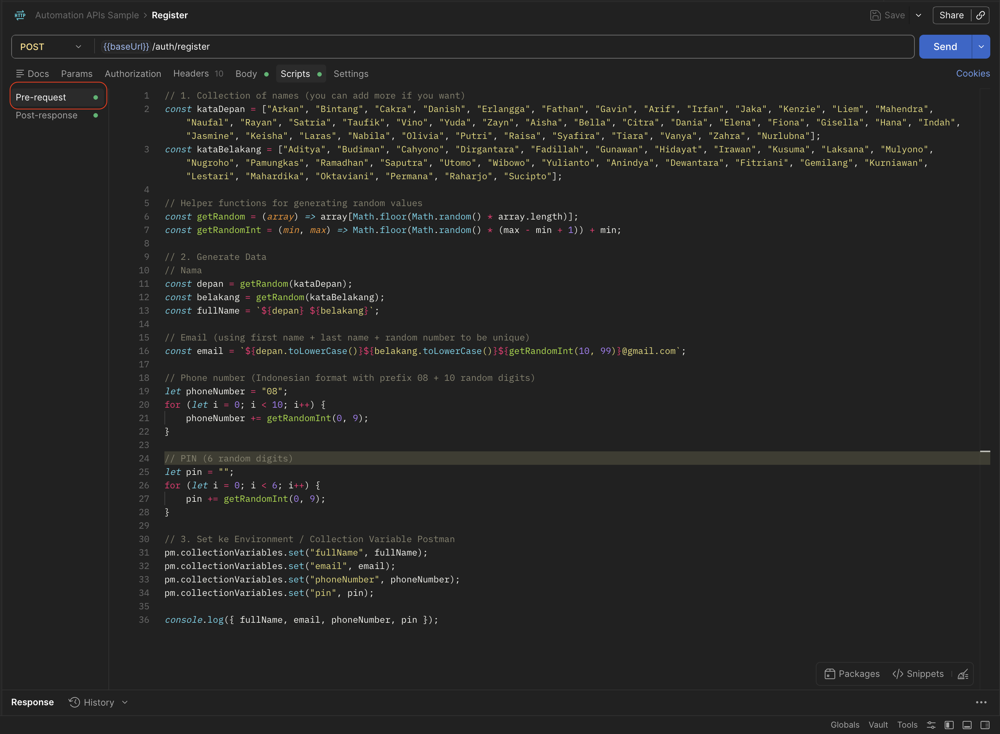

So before hit the register endpoint, the pre request script will be executed first to generate random full name, email, phone number and pin.

Now let's check the response from the register endpoint:

```
{
    "success": true,
    "message": "registration successful. please verify your OTP (email and phone).",
    "data": {
        "member_id": 16
    }
}
```

the response return data member_id, so we can save it into collection variable:

so the **post request** script is:

```
// Main test case: Ensure the response status code is 201 Created
pm.test("User success register new account", function () {
    pm.response.to.have.status(201);
});

// Additional test case: Ensure the response body structure matches expectations
pm.test("Response body matches successful registration pattern", function () {
    const responseJson = pm.response.json();
    
    // Validate that the success field must be true
    pm.expect(responseJson.success).to.eql(true);
    
    // Validate that the message contains the word success/verify
    pm.expect(responseJson.message).to.include("registration successful");
    
    // Validate that the 'data' object and 'member_id' exist in the response
    pm.expect(responseJson.data).to.have.property('member_id');
    pm.expect(responseJson.data.member_id).to.be.a('number');
});

// Save member_id to Collection Variable for use in the next request
const { data } = pm.response.json();

// Check if the data object exists before extracting member_id
if (data && data.member_id) {
    const memberId = data.member_id;
    pm.collectionVariables.set("memberId", memberId);
    console.log(`Saved memberId: ${memberId}`);
}

```

See the image below for the implementation in Postman:
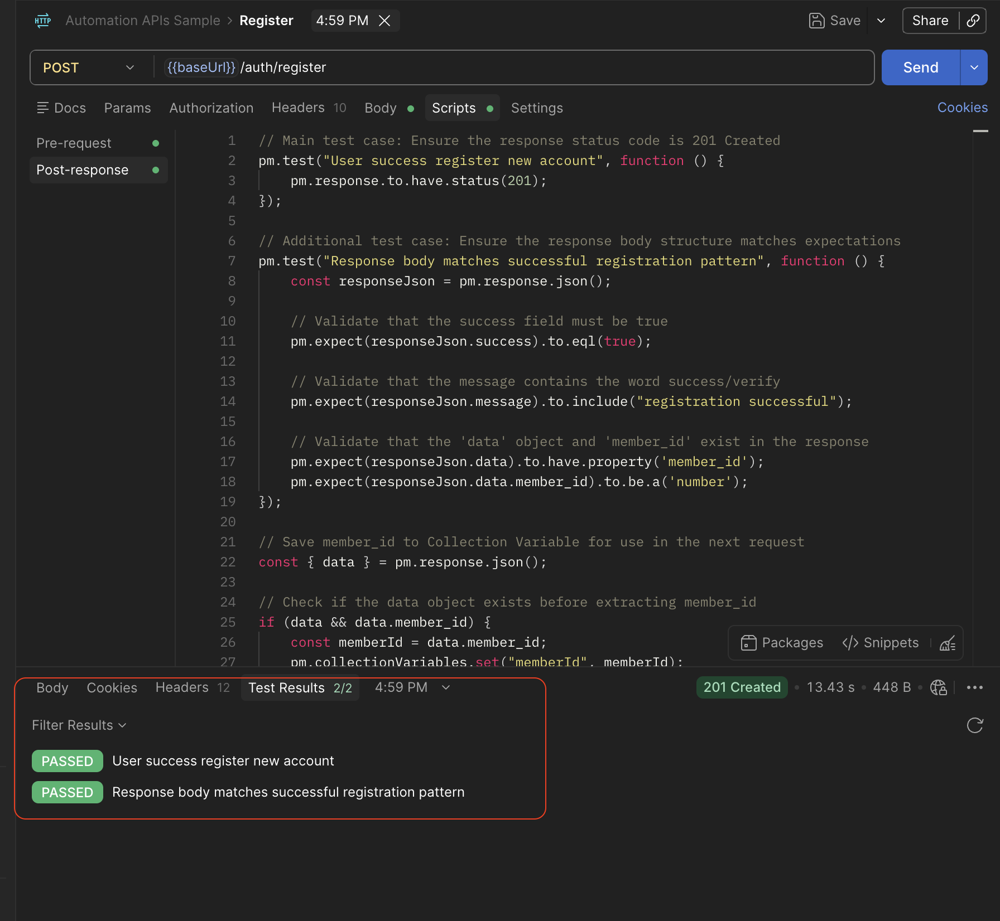

Since I created Test script, I can see the result in the image above.

## 2. OTP Verify

OTP Verify is used to verify the OTP sent to the member. This endpoint is using POST method. The payload properties are:

- `member_id`: Member ID of the member. (Integer) - (Required)
- `otp_email`: OTP code sent to the member's email. (String) - (Required)
- `otp_phone`: OTP code sent to the member's phone number. (String) - (Required)

```http
POST {{host}}/auth/otp/verify
Content-Type: application/json

{
    "member_id": "[MEMBER_ID, RETURNED FROM REGISTER POST REQUEST]",
    "otp_email": "[OTP_EMAIL, RECEIVED FROM EMAIL]",
    "otp_phone": "[OTP_PHONE, RECEIVED FROM PHONE]"
}
```

Since the otp verify endpoint needs otp_email and otp_phone, we need to get it first from the email and phone number. But, because we use dummy data email and phone number, so we can't get the otp from email and phone number. To achieve this, as a QA Engineer, we can query to database to get otp_email and otp_phone. Since the postman can't connect to database, so we can use **Pre request script** to get otp_email and otp_phone. I created [API helper with Go](https://github.com/indrabsudirman/helper-db) (e.g in my localhost) that can be used to get otp_email and otp_phone. The API parameters able to process query that can return last otp_email and otp_phone. The API helper endpoint is:

```http
http://localhost:8080/query
````

or you can try using this cURL:

```curl -s -X POST http://localhost:8080/query \
  -H "Content-Type: application/json" \
  -d '{"db_name": "[DB_NAME]", "query": "SELECT otp_code, otp_type FROM otps WHERE member_id = {{memberId}} AND is_used = false AND otp_type IN (1, 2);"}' | jq .
```

The cURL command above will return last otp_email and otp_phone. Now we can use it to verify the OTP.
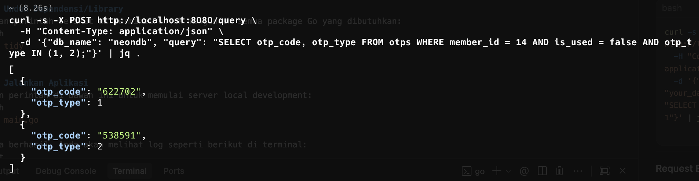

Now, let's us that cURL command in **Pre request script** to get otp_email and otp_phone. See the image below for the implementation in Postman:
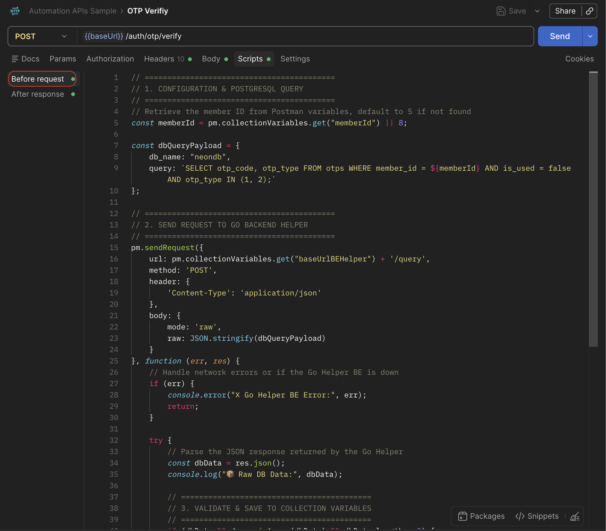

The full script is:

```
// ==========================================
// 1. CONFIGURATION & POSTGRESQL QUERY
// ==========================================
// Retrieve the member ID from Postman variables, default to 5 if not found
const memberId = pm.collectionVariables.get("memberId") || 8; 

const dbQueryPayload = {
    db_name: "neondb",
    query: `SELECT otp_code, otp_type FROM otps WHERE member_id = ${memberId} AND is_used = false AND otp_type IN (1, 2);`
};

// ==========================================
// 2. SEND REQUEST TO GO BACKEND HELPER
// ==========================================
pm.sendRequest({
    url: pm.collectionVariables.get("baseUrlBEHelper") + '/query',
    method: 'POST',
    header: {
        'Content-Type': 'application/json'
    },
    body: {
        mode: 'raw',
        raw: JSON.stringify(dbQueryPayload)
    }
}, function (err, res) {
    // Handle network errors or if the Go Helper BE is down
    if (err) {
        console.error("❌ Go Helper BE Error:", err);
        return;
    }

    try {
        // Parse the JSON response returned by the Go Helper
        const dbData = res.json();
        console.log("📦 Raw DB Data:", dbData);

        // ==========================================
        // 3. VALIDATE & SAVE TO COLLECTION VARIABLES
        // ==========================================
        if (dbData && Array.isArray(dbData) && dbData.length > 0) {
            
            // Loop through rows to differentiate between OTP Type 1 and Type 2
            dbData.forEach(item => {
                if (item.otp_type === 1) {
                    pm.collectionVariables.set("otpEmail", item.otp_code);
                    console.log("➡️ Set otp_code_type_1:", item.otp_code);
                } else if (item.otp_type === 2) {
                    pm.collectionVariables.set("otpPhone", item.otp_code);
                    console.log("➡️ Set otp_code_type_2:", item.otp_code);
                }
            });

            console.log("✅ Automation Success! DB data successfully mapped to Postman Variables.");
        } else {
            console.warn("⚠️ Query executed successfully, but no matching OTP data found in DB.");
        }

    } catch (parseError) {
        // Catches 'Expecting value' errors if the backend returns HTML or plain text instead of JSON
        console.error("❌ Failed to parse JSON. Response is not a valid JSON format.");
        console.error("📄 Raw response from Helper BE:", res.text());
    }
});
```

as we already knew the pre request script will be executed first before the request. So the result of the **pre request script** will be store into **collection variables** as following:

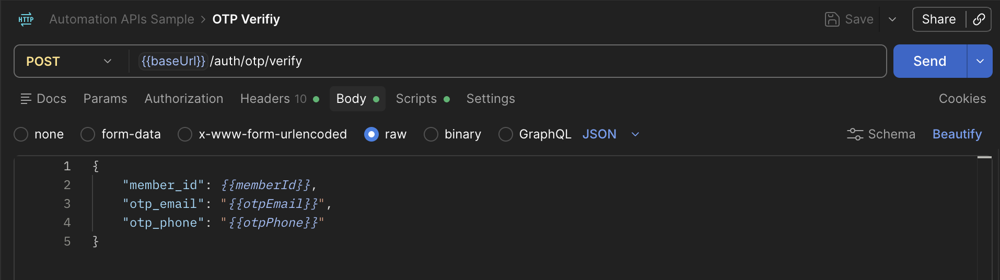

So now the **otp_email** and **otp_phone** are already filled with the valid OTP code from the database, which is we used from the previous step. Now we can send the request to the **otp/verify** endpoint.

Now let's check the response from the **/auth/otp/verify** endpoint:

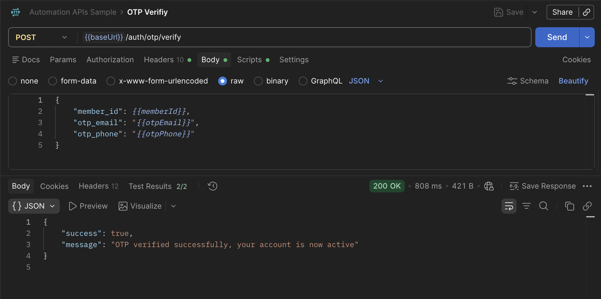

I also add a **Test Script** in the **/auth/otp/verify** request to validate the response:

```
// Main test case: Ensures response status code is 200 Created
pm.test("User success verify OTP", function () {
    pm.response.to.have.status(200);
});

// Additional test case: Ensures response body structure matches expectation
pm.test("Response body matches OTP verified successfully, your account is now active", function () {
    const responseJson = pm.response.json();
    
    // Validate that the success field must be true
    pm.expect(responseJson.success).to.eql(true);
    
    // Validate that message contains success/verify keyword
    pm.expect(responseJson.message).to.include("verified successfully");
});
```

So the result of test script will be like this:

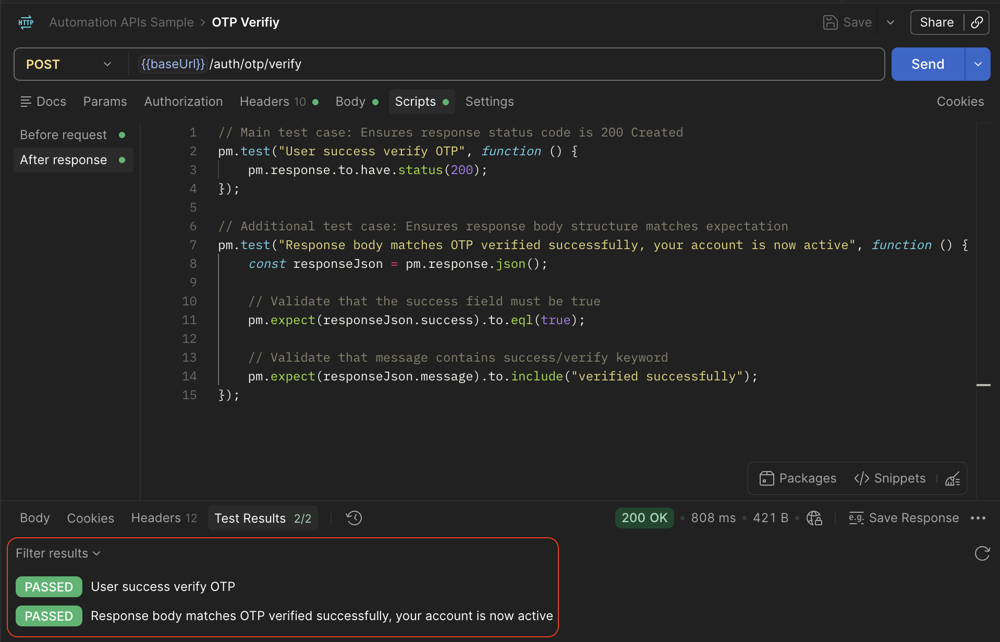

## 3. Login With Email

Since the member has been verified by submiting correct otp code in previous step, now we can login to the system. This endpoint is using POST method. The payload properties are:

- `email_or_phone`: Email or phone number of the member. (String) - (Required)
- `pin`: Pin of the member. (String) - (Required)

```http
POST {{host}}/auth/login
Content-Type: application/json

{
    "email_or_phone": "[EMAIL_ADDRESS_OR_PHONE]",
    "pin": "[PIN]"
}
```
For the login request, we can use the email / phone number and pin that we stored in the Postman collection variables from the register steps. This step I used **{{email}}** and **{{pin}}** variables in the login request. The result will be like this:
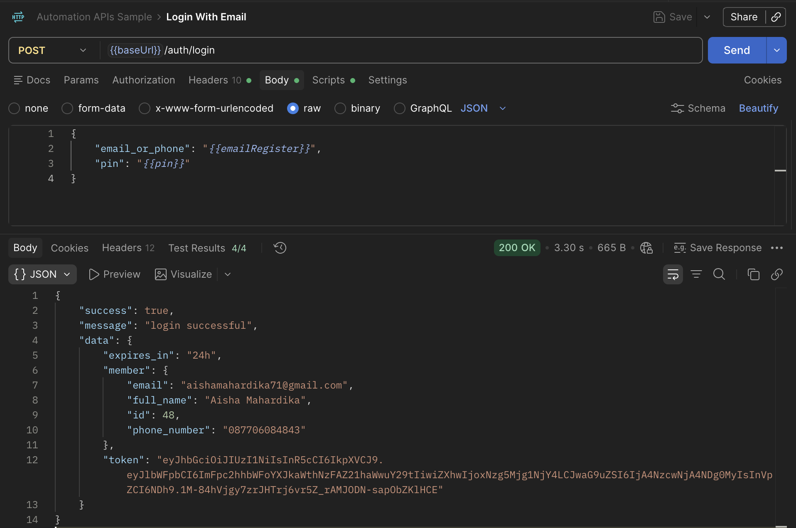

I also add **Test Script** in the **/auth/login** request to validate the response (I put at the **After Response**):

```
// Main test case: Ensures response status code is 200 OK
pm.test("User success Login with Email", function () {
    pm.response.to.have.status(200);
});

// Additional test case: Ensures response body structure matches expectation
pm.test("Response body matches login successful", function () {
    const responseJson = pm.response.json();

    // Validate that the success field must be true
    pm.expect(responseJson.success).to.eql(true);

    // Validate that message must be "login successful"
    pm.expect(responseJson.message).to.eql("login successful");

    // Validate that expires_in must be "24h"
    pm.expect(responseJson.data.expires_in).to.eql("24h");
});

// Test case: Validate member data matches the previously set variables
pm.test("Member data matches registered data", function () {
    const responseJson = pm.response.json();
    const member = responseJson.data.member;

    pm.expect(member.email).to.eql(pm.collectionVariables.get("emailRegister"));
    pm.expect(member.id).to.eql(pm.collectionVariables.get("memberId"));
    pm.expect(member.full_name).to.eql(pm.collectionVariables.get("fullName"));
    pm.expect(member.phone_number).to.eql(pm.collectionVariables.get("phoneNumber"));
});

// Test case: Save token to collection variable for use in the next request
pm.test("Token is present and saved to collection variable", function () {
    const responseJson = pm.response.json();

    pm.expect(responseJson.data.token).to.be.a("string").and.not.empty;
    pm.collectionVariables.set("tokenFromLoginEmail", responseJson.data.token);
});
```

You can see the result of test script in the image below:
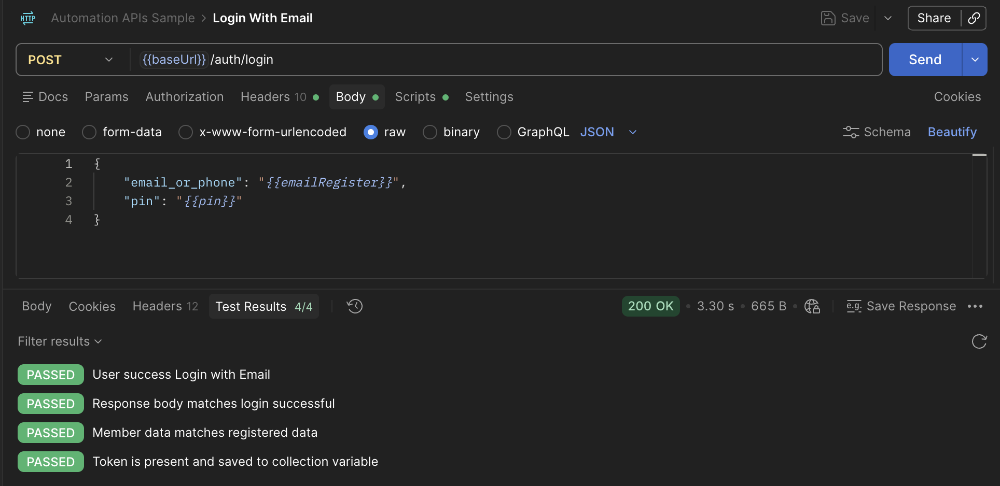

Since I create 4 test script, you can see based on the image above all of them are passed (marked with green check icon). This means the login request is successful and the response data is valid.

## 4. Login With Phone Number

Similiar with login with email, we can use phone number to login. We can use the phone number that we stored in the Postman collection variables from the register steps. This is the body payload for login with phone number, it's same with login with email but we use phone number instead of email:

- `email_or_phone`: Email or phone number of the member. (String) - (Required)
- `pin`: Pin of the member. (String) - (Required)

```http
POST {{host}}/auth/login
Content-Type: application/json

{
    "email_or_phone": "[EMAIL_ADDRESS_OR_PHONE]",
    "pin": "[PIN]"
}
```

The result will be like this:
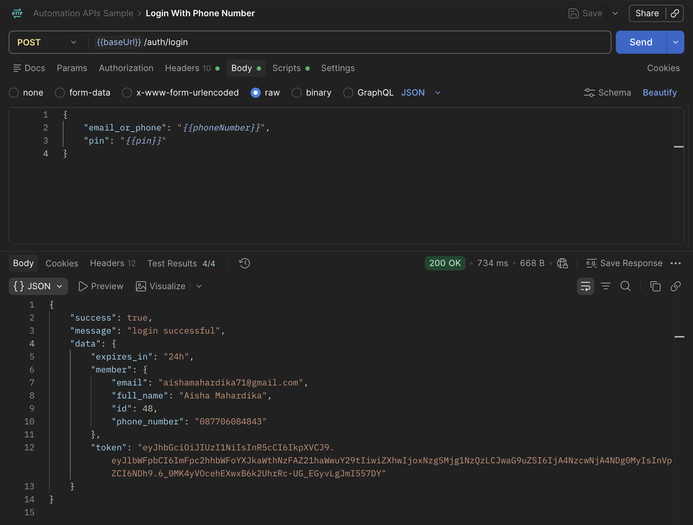

I also add **Test Script** in the **/auth/login** request to validate the response (I put at the **After Response**):

```
// Main test case: Ensures response status code is 200 OK
pm.test("User success Login with Phone Number", function () {
    pm.response.to.have.status(200);
});

// Additional test case: Ensures response body structure matches expectation
pm.test("Response body matches login successful", function () {
    const responseJson = pm.response.json();

    // Validate that the success field must be true
    pm.expect(responseJson.success).to.eql(true);

    // Validate that message must be "login successful"
    pm.expect(responseJson.message).to.eql("login successful");

    // Validate that expires_in must be "24h"
    pm.expect(responseJson.data.expires_in).to.eql("24h");
});

// Test case: Validate member data matches the previously set variables
pm.test("Member data matches registered data", function () {
    const responseJson = pm.response.json();
    const member = responseJson.data.member;

    pm.expect(member.email).to.eql(pm.collectionVariables.get("emailRegister"));
    pm.expect(member.id).to.eql(pm.collectionVariables.get("memberId"));
    pm.expect(member.full_name).to.eql(pm.collectionVariables.get("fullName"));
    pm.expect(member.phone_number).to.eql(pm.collectionVariables.get("phoneNumber"));
});

// Test case: Save token to collection variable for use in the next request
pm.test("Token is present and saved to collection variable", function () {
    const responseJson = pm.response.json();

    pm.expect(responseJson.data.token).to.be.a("string").and.not.empty;
    pm.collectionVariables.set("tokenFromLoginPhone", responseJson.data.token);
});
```

The result of test script will be like this:
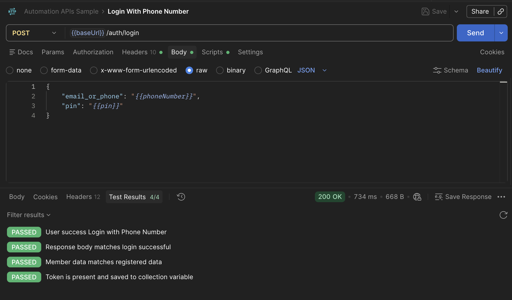

## 5. Running All Using Postman Collection Runner

After we created all the requests and added the test scripts, we can run all the requests using **Postman Collection Runner**. This feature allows us to run all the requests in a collection in a single click. To do that, we need to click the Run Collection button at the right of Postman, you can see the image below:

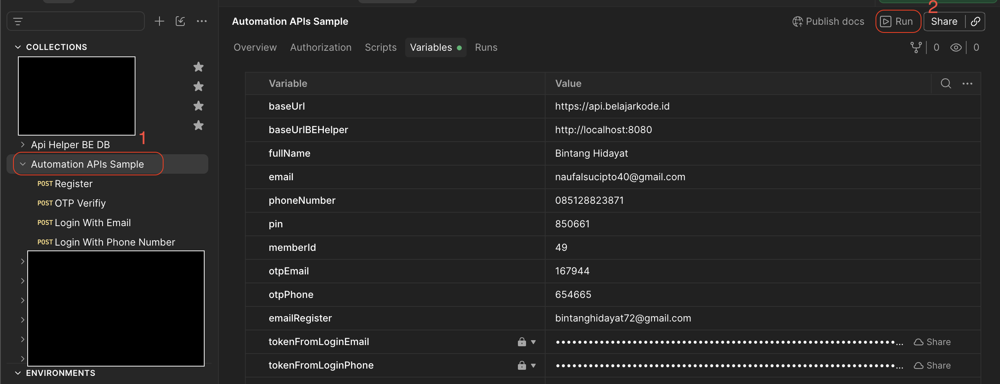

and see the result as follow :

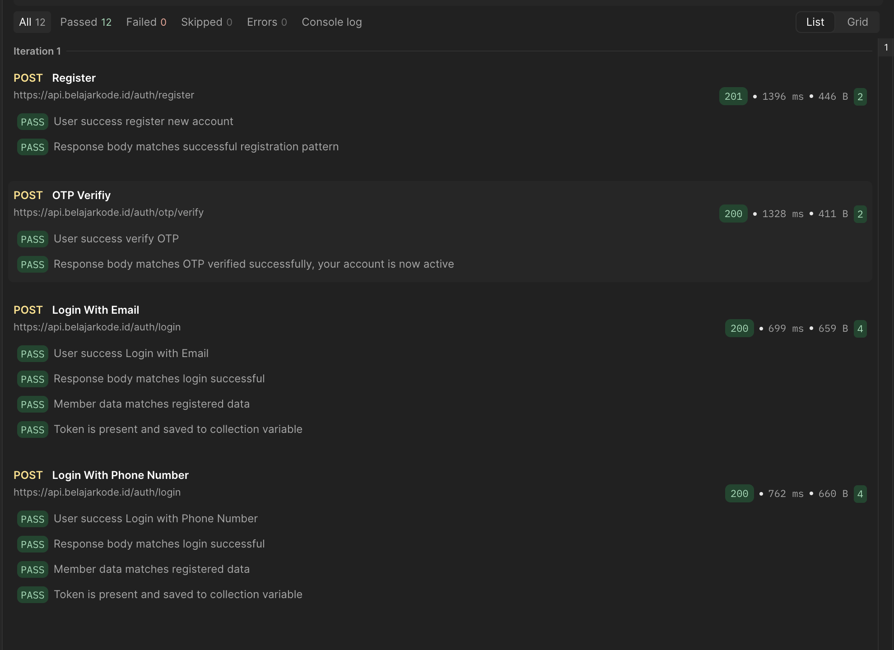

## 6. Running Using Newman CLI

How about if we want to run the collection using CLI? The answer is, yes it's possible. We can run it using Newman CLI, if you plan to run the collection in the CI CD.

`Newman is a command-line tool for running Postman Collections. Use Newman to run and test collections from the command line instead of in the Postman app. Newman is built with extensibility in mind, so you can incorporate it in your continuous integration (CI) pipelines and build systems.`

Let's install newman using npm :
```
npm install -g newman newman-reporter-htmlextra newman-reporter-allure allure-commandline
```

the command above will install newman and newman report (html), newman allure and allure commandline. If you curious regarding allure, you can visit the official web [Allure Report](https://allurereport.org/)

Once you have installed, the Newman you can check use this command :

```
npm list -g --depth=0 | grep newman
```

the command above, will return :
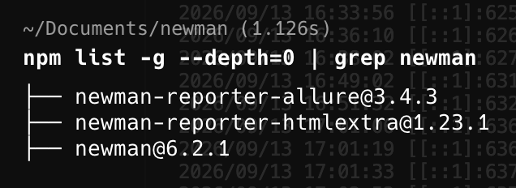

Let's start running APIs Testing using Newman.The first command I will run the Newman and generate html report. The command as follow :

```
newman run "Register Automation APIs Testing.json" \
  --env-var "baseUrl=https://api.belajarkode.id" \
  --env-var "baseUrlBEHelper=http://localhost:8080" \
  --reporters cli,htmlextra \
  --reporter-htmlextra-export ./report/report.html
```

before you run the command above, make sure you have already export json postman collection, as you see in my command above, the first argument *Register Automation APIs Testing.json* is the result file from export postman collection.

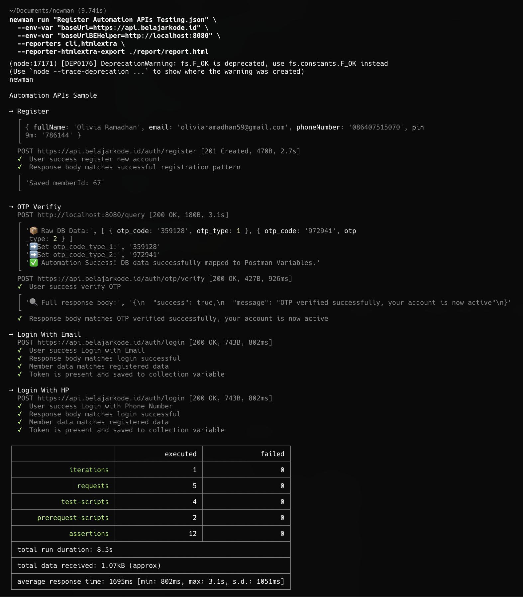

if we open the html report, we can see the report as follow : 

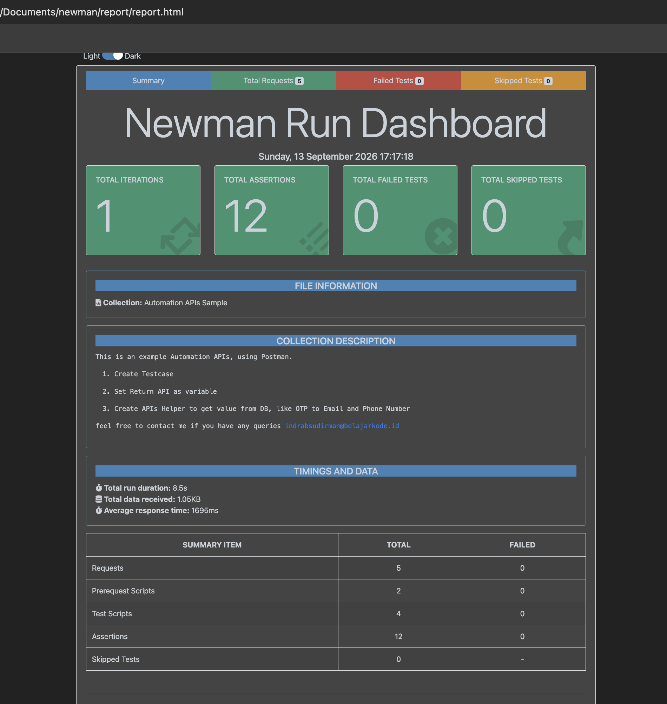

Now, let's try run again the API test using Newman + Allure report. The command as follow :

```
newman run "Register Automation APIs Testing.json" \
  --env-var "baseUrl=https://api.belajarkode.id" \
  --env-var "baseUrlBEHelper=http://localhost:8080" \
  --reporters cli,allure \
  --reporter-allure-export ./report/allure-results
```

the result as follow :
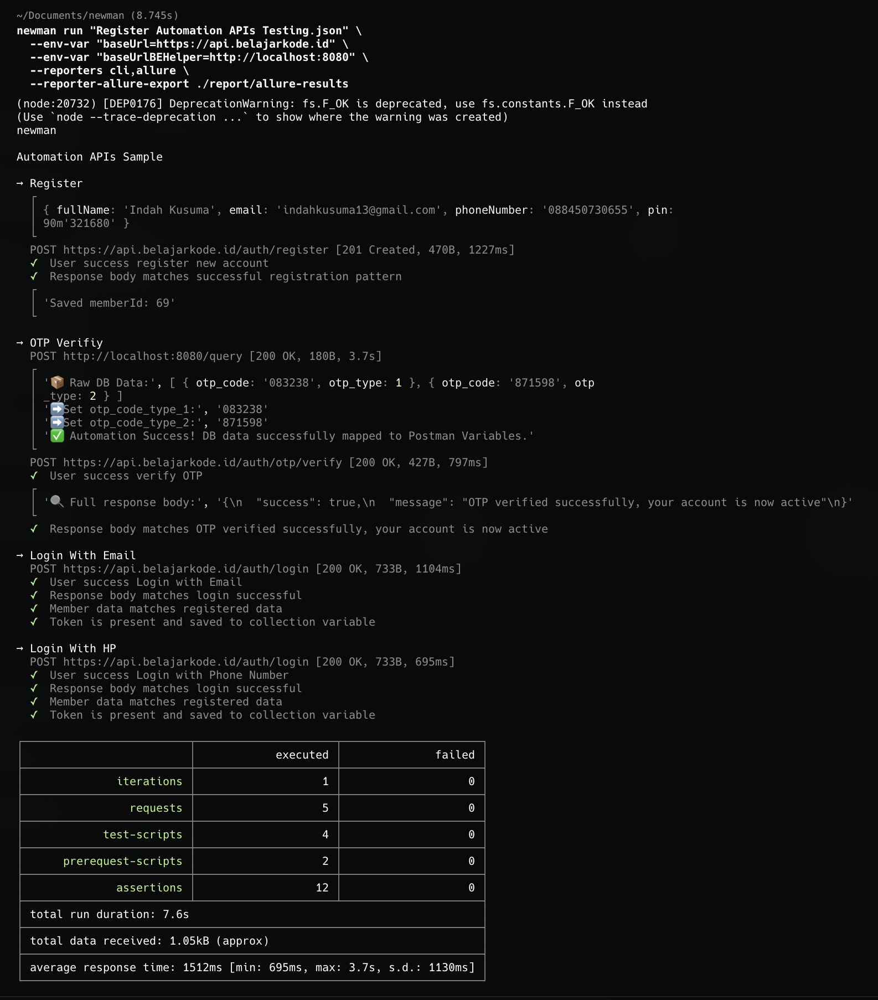

we can open the Allure report, using this command :
```
allure serve allure-results
```

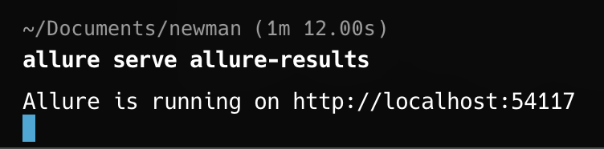

We can see the report, like this :

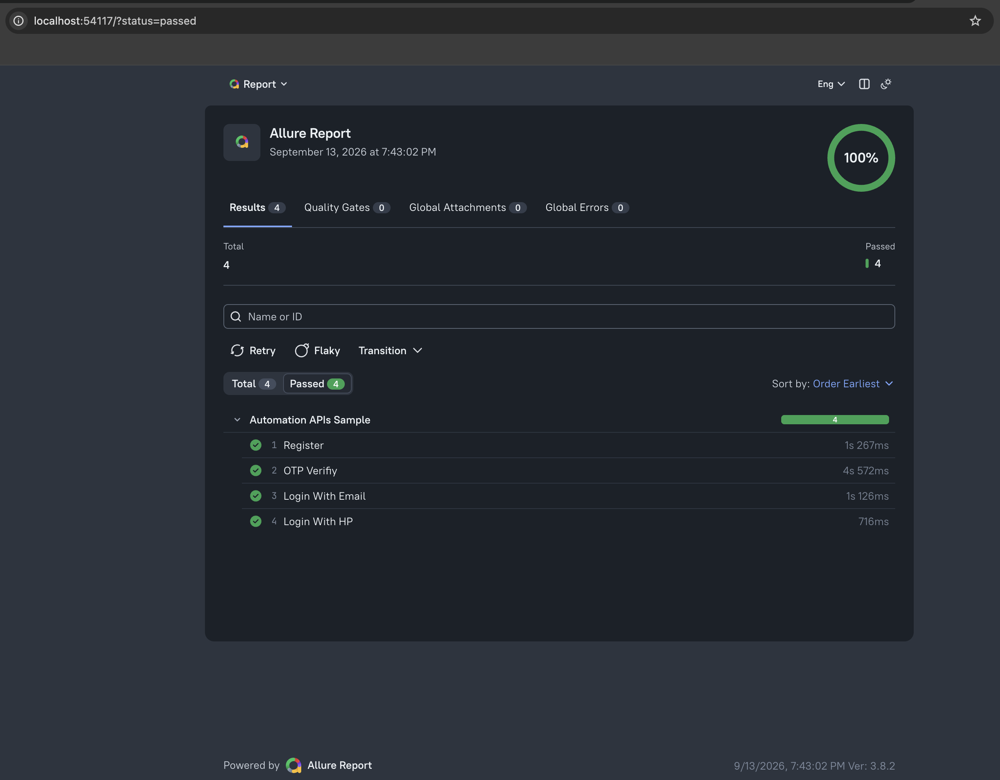

You can see the Postman Collection for this notes at this [Github link.](https://github.com/indrabsudirman/my-apis-collection/tree/main/register-apis-sample)

That's all my notes.


